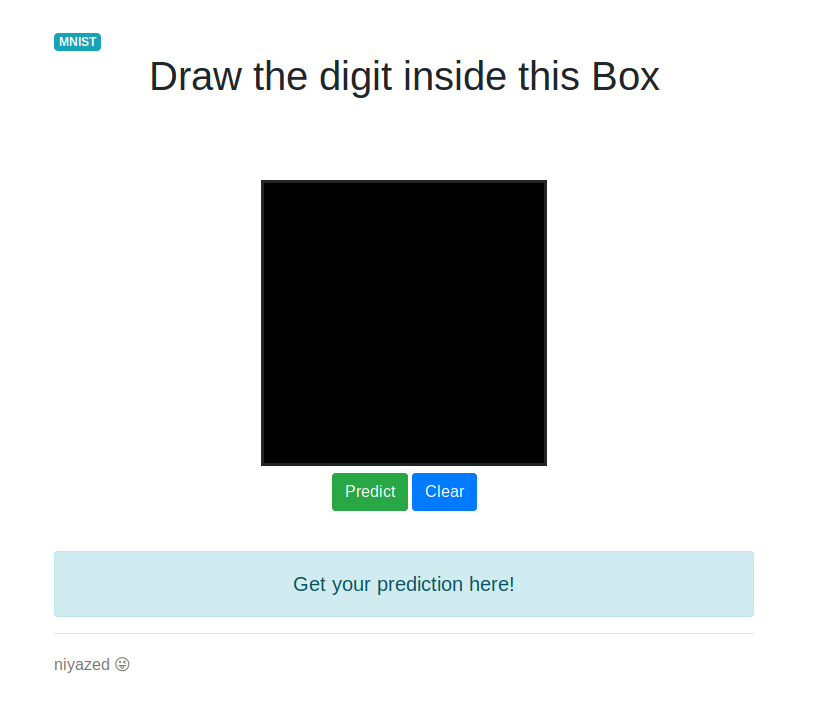

# flask-mnist-handwritten

### A Simple MNIST Handwritten Digit recognition app using flask API and Keras.
#### Goto Root Directory

`$ python app.py`
Reference - https://www.pytorials.com/deploy-keras-model-to-production-using-flask/
